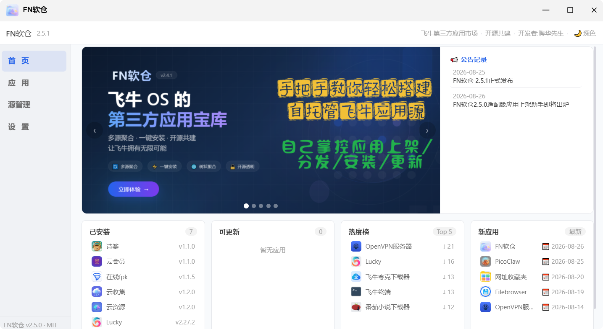
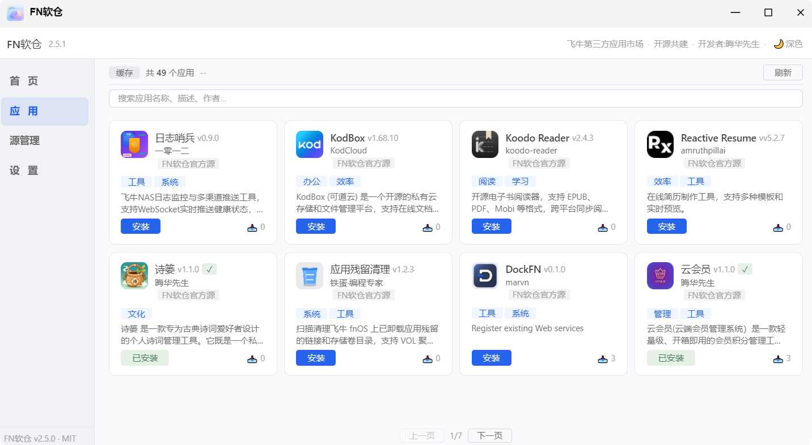
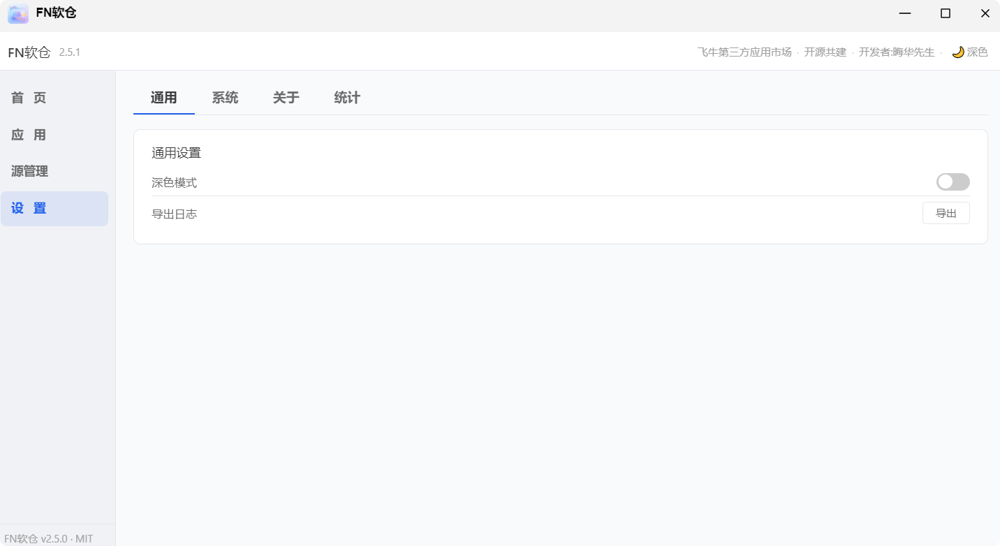

# FN软仓客户端

[](https://gitee.com/hhxs2025/fn-appstores)
[]()
[]()

---


## 📖 项目简介

FN软仓是飞牛OS上的第三方应用商店客户端，支持**多软件源聚合**。用户可自由添加自托管服务端地址，安装、体验飞牛官方应用中心没有的其他三方应用。

| 链接 | 说明 |
| :--- | :--- |
| **客户端项目地址** | [https://gitee.com/hhxs2025/fn-appstores](https://gitee.com/hhxs2025/fn-appstores) |
| **服务端镜像拉取** | `docker pull ccr.ccs.tencentyun.com/hhxs2025/fn-appstores-server:2.5.4` |


## 🖼️ 界面预览

| 首页（轮播+公告记录） | 应用列表 | 设置页 |
| :---: | :---: | :---: |
|  |  |  |

> 左侧导航设计，首页默认展示轮播图、公告记录、快捷卡片（已安装/可更新/热度榜/新应用）


## ✨ 核心功能

| 功能模块 | 说明 |
| :--- | :--- |
| **左侧导航布局** | 桌面端侧边栏，移动端折叠为汉堡菜单，支持窄屏图标模式 |
| **首页看板** | 轮播图（70%）+ 公告记录列表（30%），四列快捷卡片：已安装/可更新/热度榜/新应用 |
| **公告缓存** | 首页公告数据 5 分钟内存缓存，切换页面秒开，体验更流畅 |
| **公告记录** | 支持多条公告列表（日期 + 标题），点击弹窗查看详情（支持富文本） |
| **多源应用聚合** | 从所有启用的源拉取应用列表，自动去重（保留较新版本），卡片显示来源 |
| **软件源管理** | 添加/删除/启用/禁用软件源，源状态缓存 5 分钟，页面秒开 |
| **一键安装/更新** | 支持安装向导，WebSocket 实时推送下载进度，进度百分比显示；安装任务队列支持断线续传（v2.6.1） |
| **应用列表排序** | 支持按名称、下载量、更新时间排序（v2.6.0 新增） |
| **安装即时刷新** | 安装完成后自动更新卡片状态，无需等待整页刷新（v2.6.0 新增） |
| **来源标识** | FN认证标识（`✅FN-`），官方源/认证三方源/自添加源视觉区分 |
| **应用类型筛选** | 应用列表支持按「全部 / Docker应用 / 原生应用」分类筛选 |
| **按源名称筛选** | 下拉选择框按来源快速过滤应用（v2.5.2 新增） |
| **设置中心** | 标签切换：通用（深色模式/导出日志/清除缓存）/ 系统（版本/架构/检查更新）/ 关于（开发者/协议/仓库/群/聚合申请/二维码/源查询）/ 统计 |
| **客户端自更新** | 设置页「检查更新」自动检测最新版本，下载 FPK 后引导用户前往应用中心手动安装 |
| **数据持久化** | `sources.json` 存储于 `TRIM_PKGVAR` 持久化目录，应用更新后用户配置不丢失 |
| **应用列表自过滤** | FN软仓客户端自身不再显示于应用列表中，避免用户误操作 |
| **主题切换** | 深色/浅色模式一键切换，偏好保存至浏览器 |
| **中继环境适配** | API 地址动态适配 `window.location.origin`，无需额外反代 |
| **WebSocket 连接管理（v2.6.1）** | 统一 WebSocket 实例管理，动态协议适配（支持 HTTPS），指数退避重连，页面关闭自动清理资源 |
| **错误降级与离线缓存（v2.6.1）** | 网络请求失败时自动降级使用本地缓存，源列表加载失败时保留上次成功列表，避免白屏 |

> **v2.3.2+ 配合服务端 v2.4.0+ 使用**，支持树状聚合架构，官方源可聚合三方源应用，用户无需自行添加三方源即可发现更多应用。


## 📖 使用指南

### 首页看板

打开软仓默认进入「首页」，包含：

- **顶部轮播图**：展示平台宣传图（占70%宽度）
- **公告记录**：显示最近5条公告（标题 + 日期），点击可查看全文（5分钟缓存）
- **快捷卡片**：已安装/可更新/热度榜/新应用，点击卡片内任意应用可直接查看详情

### 浏览应用

- 点击左侧导航「应用」进入应用列表
- 使用分类标签（影音/办公/下载/AI/设计/社交/网络/工具/生活/商务/教育/效率/开发/游戏）快速筛选
- 使用「Docker应用 / 原生应用」筛选器按应用类型过滤
- 使用「按源名称」下拉框按来源过滤
- 点击排序下拉框按名称、下载量或更新时间排序（v2.6.0 新增）
- 在搜索框输入关键词查找特定应用
- 应用卡片显示来源标签（官方源/认证三方源/自添加源）和下载量

### 安装应用

1. 点击应用卡片进入详情页
2. 点击「安装」按钮
3. 如应用有向导，填写配置项后确认
4. 等待进度条和百分比数字完成（v2.6.0 新增百分比显示）
5. 安装成功后卡片状态自动更新为「已安装」（v2.6.0 即时刷新）

> **v2.6.1 优化**：安装请求加入任务队列，即使 WebSocket 短暂断开，安装也会在连接恢复后自动继续，不再丢失请求。

### 更新应用

- 已安装应用有新版本时，卡片显示「更新」按钮
- 点击「更新」，自动下载新版并安装
- 首页「可更新」卡片汇总所有可更新应用

### 客户端自身更新

1. 点击左侧导航「设置」→「系统」
2. 点击「检查更新」按钮
3. 如有新版本，自动下载 FPK 文件到浏览器下载目录
4. 下载完成后弹窗提示，前往飞牛应用中心 → 手动安装 → 上传已下载的 FPK 文件

> FN软仓客户端自身不会出现在应用列表中，更新入口统一在「设置 → 系统」中。

### 管理软件源

1. 点击左侧导航「源管理」
2. 查看所有已配置的源及其状态（在线/离线/已禁用）
3. 点击「添加源」，填写名称和地址
4. 点击「测试」验证连通性，确认后添加
5. 可随时启用/禁用或删除自定义源（官方源不可删除）

### 系统设置

1. 点击左侧导航「设置」
2. 切换标签页：通用 / 系统 / 关于 / 统计
   - **通用**：深色模式开关、导出日志、**清除本地缓存（v2.6.0 新增）**
   - **系统**：客户端版本、系统架构、检查更新
   - **关于**：开发者、开源协议、源码仓库、交流群、**聚合申请（v2.6.0 新增）**、**QQ群二维码（v2.6.0 新增）**、官方源查询
   - **统计**：总应用数、已安装、可更新、已配置源


## 📜 版本历程

```
2.1.1 ──► 2.2.0-beta ──► 2.2.0 ──► 2.2.1 ──► 2.2.2 ──► 2.2.3 ──► 2.3.0
──► 2.3.1 ──► 2.3.2 ──► 2.3.3 ──► 2.3.4 ──► 2.4.0 ──► 2.4.1 ──► 2.5.0
──► 2.5.1 ──► 2.5.2 ──► 2.6.0 ──► 2.6.1
```

| 版本 | 主要更新 |
| :--- | :--- |
| **v2.1.1** | 单一官方源，基础安装功能 |
| **v2.2.0-beta** | 多源管理初版（添加/删除/启用/禁用） |
| **v2.2.0** | 公告板 + 应用接入链接 |
| **v2.2.1** | 飞牛官方中继适配（`window.location.origin`） |
| **v2.2.2** | 源状态缓存 5 分钟 + 多源公告适配 |
| **v2.2.3** | 精简为单官方源，地址迁移至 `rc.hhxs2026.top:5660` |
| **v2.3.0** | 应用卡片新增下载统计显示，公告板支持 HTML |
| **v2.3.1** | 向导环境变量双写，修复应用安装失败问题 |
| **v2.3.2** | 三方源来源标签保留，应用来源标识优化 |
| **v2.3.3** | 占位符替换（`${key}`），安装验证强化，向导 UI 优化 |
| **v2.3.4** | 关于页公告板内容推送升级为整个关于页自定义 |
| **v2.4.0** | 关于页轮播图 + 自定义间隔 + 树状聚合架构适配 |
| **v2.4.1** | 轮播图手动切换 + 状态筛选独立行 + 富文本支持 + 公告超链接 |
| **v2.5.0** | 左侧导航 + 首页重构（轮播+公告记录+四列快捷卡片）+ 设置页 + 默认首页【内部测试版】 |
| **v2.5.1** | 数据持久化 + 客户端自更新 + 应用类型筛选 + 自过滤 + 首页加载优化 + 模板拆分 |
| **v2.5.2** | 官方源地址隐藏/禁用移除；三方源启用/禁用逻辑修正；Docker/原生筛选修复；按源名称筛选；缓存标签恢复；新增「商务」「教育」标签；新应用卡片增至10个；版本号动态化 |
| **v2.6.0** | **应用列表排序**：按名称、下载量、更新时间排序<br>**安装进度显示**：实时百分比数字<br>**安装即时刷新**：安装完成后自动更新卡片状态<br>**设置页增强**：清除缓存按钮、聚合申请入口、QQ群二维码<br>**详情弹窗优化**：固定 4:3 比例 |
| **v2.6.1** | **WebSocket 统一管理**：移除双定义冲突，动态协议适配 HTTPS，指数退避重连<br>**安装任务队列**：断线重连后安装请求自动续传，状态统一清理<br>**缓存读写统一**：统一缓存入口 + 版本号，安装/刷新后立即写入缓存<br>**并发加载锁**：防止重复请求，首页快捷卡片就绪检查<br>**DOM 空值保护**：全面加固，避免元素缺失导致脚本中断<br>**错误降级**：网络失败时自动降级离线缓存，源列表保留上次成功数据 |


## ❓ 常见问题

<details>
<summary><b>打开软仓后一直显示“加载中”？</b></summary>

1. 检查飞牛设备网络是否正常
2. 尝试点击右上角「刷新」按钮
3. 检查客户端日志：`/vol*/@appdata/fn-appstores-client/var/app.log`
</details>

<details>
<summary><b>应用列表加载慢？</b></summary>

首次加载需从服务端拉取数据，受网络影响。后续访问会使用缓存，速度会明显提升。
</details>

<details>
<summary><b>可更新卡片显示“暂无应用”？</b></summary>

1. 确认是否有已安装应用存在新版本
2. 点击右上角「刷新」按钮强制拉取最新数据
3. 如确认有可更新应用但仍不显示，请升级至 v2.5.1+
</details>

<details>
<summary><b>新应用卡片排序不正确？</b></summary>

1. 确认服务端返回的应用数据包含 `updated_at` 字段
2. 如所有应用 `updated_at` 相同（如全是当天日期），检查服务端 `app.py` 是否有自动补全逻辑
3. 建议移除服务端的自动补全，或改为固定日期 `1970-01-01`
</details>

<details>
<summary><b>截图不显示？</b></summary>

1. 确认服务端 `previews/{app_id}/` 目录下有截图文件
2. 文件命名应为 `1.PNG`、`2.PNG`（大小写敏感）
3. 确认服务端地址可正常访问
</details>

<details>
<summary><b>安装失败？</b></summary>

1. 确认飞牛系统有足够的存储空间
2. 检查服务端 `apps/` 目录下是否存在对应的 `.fpk` 文件
3. 查看 `app.log` 日志获取详细错误信息
4. 如遇 WebSocket 连接问题，升级至 v2.6.1+ 可获得更好的断线重连支持
</details>

<details>
<summary><b>三方源应用来源标签显示为“FN软仓官方源”？</b></summary>

请升级客户端到 v2.3.2 及以上版本，并确保服务端为 v2.4.0 及以上版本。客户端会正确保留服务端返回的来源信息。
</details>

<details>
<summary><b>公告内容不显示或格式错乱？</b></summary>

1. 确认服务端 `notice.json` 使用 `records` 数组格式（v2.5.0+）
2. 富文本仅支持 `<p>`、`<a>`、`<b>`、`<strong>`、`<h1>`~`<h5>`、`<br>`、`style="font-size/color"`
3. 使用 `<br>` 标签换行，而非 `\n`
</details>

<details>
<summary><b>如何在设置页检查客户端更新？</b></summary>

1. 打开 FN软仓 → 设置 → 系统
2. 点击「检查更新」按钮
3. 如有新版本，浏览器自动下载 FPK
4. 前往飞牛应用中心 → 手动安装 → 上传 FPK
</details>

<details>
<summary><b>更新客户端后，之前添加的源还在吗？</b></summary>

v2.5.1+ 已修复此问题。`sources.json` 现存储于 `TRIM_PKGVAR` 持久化目录（`/vol*/@appdata/fn-appstores-client/`），应用更新后用户添加的源不会丢失。
</details>

<details>
<summary><b>应用列表排序不生效？</b></summary>

确认排序下拉框已选择非「默认排序」选项；排序在筛选之后执行，请先确认筛选条件正确。
</details>

<details>
<summary><b>WebSocket 连接失败或安装请求丢失？</b></summary>

v2.6.1+ 已优化 WebSocket 连接管理：
1. 统一 WebSocket 实例，避免双定义冲突
2. 自动适配 HTTP/HTTPS 协议
3. 断线后自动重连（指数退避，最大 10 次）
4. 安装请求加入任务队列，连接恢复后自动续传
</details>

<details>
<summary><b>网络抖动时页面空白或加载失败？</b></summary>

v2.6.1+ 已增强错误降级：
1. 应用列表加载失败时自动使用本地缓存
2. 源列表加载失败时保留上次成功数据
3. 首页公告加载失败时使用过期缓存兜底
</details>


## 👨‍💻 开发者信息

| 项目 | 信息 |
| :--- | :--- |
| **作者** | 晦华先生 |
| **联系方式** | 2303537063@qq.com |
| **开源地址** | [https://gitee.com/hhxs2025/fn-appstores](https://gitee.com/hhxs2025/fn-appstores) |


## 🤝 参与共建

欢迎开发者自托管服务端接入 FN软仓生态，或为现有应用提供更新维护。如有疑问请联系作者。