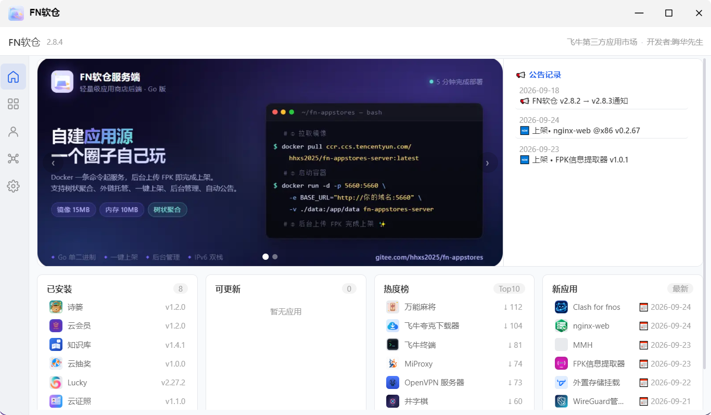
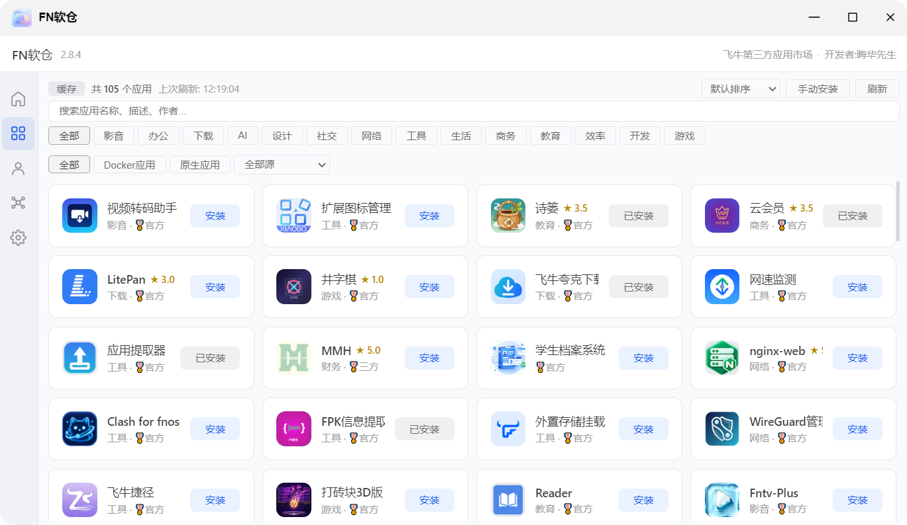

# FN软仓客户端

> 飞牛 OS 第三方应用商店客户端
---

---

## 📖 应用简介

FN软仓是飞牛 OS 上的第三方应用商店客户端，支持**多软件源聚合**。用户可以自由添加自托管服务端地址，浏览、安装、更新飞牛官方应用中心没有的三方应用。

- **项目地址**：[https://gitee.com/hhxs2025/fn-appstores](https://gitee.com/hhxs2025/fn-appstores)
- **服务端镜像**：`docker pull ccr.ccs.tencentyun.com/hhxs2025/fn-appstores-server:2.8.4`
- **平台**：飞牛 OS
- **架构**：x86 / ARM 双架构兼容【修复的arm版兼容性待测试】
- **开源协议**：MIT

> **架构支持说明**：单 fpk 内含 `fn-appstores-client-amd64` 与 `fn-appstores-client-arm64` 双二进制，`cmd/main` 按 `uname -m` 自动选择。安装逻辑已适配用户卷（`/vol*/@appcenter`）与系统分区（`/usr/local/apps/@appcenter`），支持 `install_type = root` 应用。

---

## ✨ 核心功能

### 应用管理

- **多源聚合**：从所有启用的软件源并发拉取应用列表，按 `id@platform` 自动去重
- **树状聚合**：官方源可聚合多个三方源应用，无需手动添加即可发现更多应用
- **分类筛选**：15 个固定分类 + Docker/原生类型筛选 + 按源筛选
- **排序**：支持按名称、下载量、更新时间排序
- **全局搜索**：侧边栏顶部搜索框，任意页面可直接搜索
- **架构自动适配**：启动时检测本机架构，不兼容的应用自动过滤

### 安装与更新

- **一键安装**：支持安装向导、环境变量填写
- **实时进度**：WebSocket 推送下载进度、速度、已下载/总大小
- **一次性下载 + 格式校验**：单次 GET 完整下载，gzip 魔数校验失败自动重试（最多 3 次），适配 Gitee 外链托管
- **Docker 应用验证**：容器必须 `running` 才算成功，失败自动清理残留容器
- **手动安装入口**：应用页工具栏「手动安装」，支持本地 FPK 上传，显示完整安装日志
- **客户端自更新**：设置页一键检测最新版本，下载后引导手动安装

### 应用评分

- **5 星评分**：详情页内点击星星打分，本地记录"我的评分"
- **评分展示**：应用卡片名称右侧内联显示平均分（★ 4.5）

### 软件源管理

- **添加/删除/启用/禁用**：填写名称和地址，测试连通性后添加
- **状态检测**：源列表显示在线/离线/已禁用，状态缓存 5 分钟
- **官方源保护**：官方源不可删除，地址隐藏显示
- **官方源地址自动迁移**：老用户升级后自动替换内置源地址

### 界面与体验

- **飞牛统一网关**：通过 `/app/fn-appstores-client` 访问，复用飞牛登录态，自动适配 HTTPS
- **HTTPS 图片代理**：HTTPS 页面下 HTTP 图片自动走同源代理
- **轮播图双链路兜底**：支持 `v6URL|v4URL` 双地址格式，主地址失败自动降级
- **开发者星球**：3D 球面可视化开发者，拖动旋转、滚轮缩放、悬停查看
- **深色/浅色主题**：一键切换，偏好保存至浏览器
- **骨架屏加载**：首次加载显示灰色占位卡片，避免空白

---

## 🧭 界面介绍

左侧导航栏共 5 项，桌面端 140px 宽，窄屏（≤1100px）折叠为单图标，移动端（≤768px）折叠为汉堡菜单。每项配统一线条 SVG 图标。侧边栏顶部为全局搜索框，输入关键词自动切换到应用页并筛选。

### 🏠 首页

- **顶部轮播图**（占 70%）：平台宣传图，点击可查看大图
- **公告记录**（占 30%）：最近 5 条公告，点击查看详情
- **四列快捷卡片**：已安装 / 可更新 / 热度榜 Top 10 / 新应用
- **点击卡片项**：自动切换到应用页并打开对应详情

---
### 📦 应用

- **工具栏**：状态 + 应用数 + 排序 + 手动安装 + 刷新
- **分类标签**：15 个固定分类
- **类型/源筛选**：按 Docker / 原生、按来源过滤
- **应用网格**：一次加载全部，无分页
- **应用卡片**：图标 + 名称 + 评分 + 分类·来源 + 安装按钮
- **应用详情**：主内容区切换，含大图标、元信息栏、更新内容、应用介绍、预览轮播、评分、README 链接

---
### ✨ 开发者

- 3D 球面可视化开发者，星星大小与应用数挂钩
- 三种配色：金色（官方）、蓝色（认证）、白色（个人）
- 拖动旋转、滚轮缩放、悬停查看；搜索时命中对象高亮
- 窄屏自动降级为卡片列表

---
### 🔗 源管理

- **添加源**：填写名称和地址，可先测试连通性
- **官方源**：地址隐藏显示为 `●●●●●●●`，不可删除
- **三方源**：可启用、禁用、删除

### ⚙️ 设置

- **通用**：深色模式、导出日志、清除缓存
- **系统**：客户端版本、系统架构、检查更新
- **关于**：开发者、源码仓库、交流群、应用上架、聚合申请
- **统计**：总应用数、已安装、可更新、已配置源
- **建源**：自建源指引、三步部署

---

## 📜 版本记录

### v2.8.4

**修复 ARM 安装失败 + 新增手动安装入口**【修复的arm版兼容性待测试】

**🐛 修复**
- **修复 ARM 设备安装应用报「安装目录不存在」**：旧版本扫描安装目录的方式在 ARM 上不成立，现改为自动扫描所有存储位置，x86 / ARM 通用【修复的arm版兼容性待测试】
- **修复安装前未设置默认存储空间时的报错**：提示更友好，并会自动尝试几个常见存储位置
- **兼容系统分区应用**：`install_type = root` 声明装到系统分区的应用，之前会误报安装失败，现已正确识别

**✨ 新增**
- **手动安装入口**：应用页工具栏新增「手动安装」，可直接上传本地 FPK 安装，并显示完整安装日志
- **x86 / ARM 双架构单包**：一个 fpk 内同时打包两种架构的二进制，安装时自动选择，无需区分设备【修复的arm版兼容性待测试】

**⚙️ 优化**
- **默认安装位置自动检测**：自动读取用户在飞牛应用中心设置的默认存储空间
- **安装日志更完整**：`install-fpk` 的完整输出会写入客户端日志

### v2.8.3

**纯 UI 改版：应用卡片精简 + 详情页改版 + 侧边栏搜索 + 取消分页**

- **应用卡片精简**：只保留图标、名称、评分、分类来源、按钮，一屏可见应用数翻倍
- **详情页改版**：从弹窗改为主内容区切换，带 ← 返回按钮，含元信息栏
- **侧边栏全局搜索**：搜索框移到侧边栏顶部
- **取消分页**：应用列表一次加载全部
- **按钮视觉弱化**：安装/更新按钮从实心色块改为浅色底 + 彩色字
- **轮播图双链路兜底**：支持 `v6URL|v4URL` 格式

### v2.8.2

- **官方源地址迁移**
- **Docker 应用安装结果验证**：容器必须 `running` 才算成功
- **安装失败自动清理**：避免留下 `Created` 状态的孤儿容器
- **双架构单包**：单个 FPK 内含 amd64 / arm64 两个二进制【arm版兼容存在问题,排查中】

### v2.8.1

- 设置页：新增建源指南
- 开发者页：修复星球视图下搜索开发者功能无效的问题
- 外链托管加固、自动公告、健康检查调整、三方源列表并行探测

### v2.8.0

- 新增应用评分系统（5 星评分）
- 架构自动检测，应用列表按架构过滤
- 应用字段 `arch` 统一改为 `platform`
- 新增骨架屏、搜索防抖、图标懒加载
- 下载策略改为一次性 GET，适配 Gitee 外链托管

### v2.7.0

- 后端从 Python 迁移到 Go + Gin，单二进制无运行时依赖
- 新增开发者星球页面
- 新增独立安装进度弹窗
- 新增安装 30 分钟超时强制复位

### v2.6.2

- 接入飞牛统一网关，应用改走 Unix Socket
- 通过 `/app/fn-appstores-client` 路径访问，复用飞牛登录态
- 自动适配 HTTPS，页面与 WebSocket 走 `https://` / `wss://`

### v2.6.1

- WebSocket 统一管理，指数退避重连
- 安装任务队列，断线重连后请求自动续传
- 缓存读写统一入口，并发加载锁，错误降级

### v2.6.0

- 应用列表支持多字段排序
- 安装进度实时百分比
- 安装完成自动更新卡片状态
- 设置页新增清除缓存、聚合申请、QQ 群二维码

### v2.5.2

- 官方源地址隐藏，移除禁用按钮
- 新增「商务」「教育」分类标签
- 新应用卡片增至 10 个

---

## 👨‍💻 开发者信息

| 项目 | 信息 |
| :--- | :--- |
| **开发者** | 晦华先生 |
| **联系方式** | 2303537063@qq.com |
| **开源地址** | [https://gitee.com/hhxs2025/fn-appstores](https://gitee.com/hhxs2025/fn-appstores) |
| **交流群** | 2154077576 |